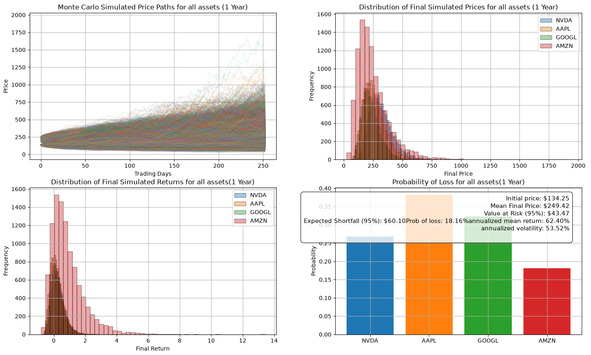
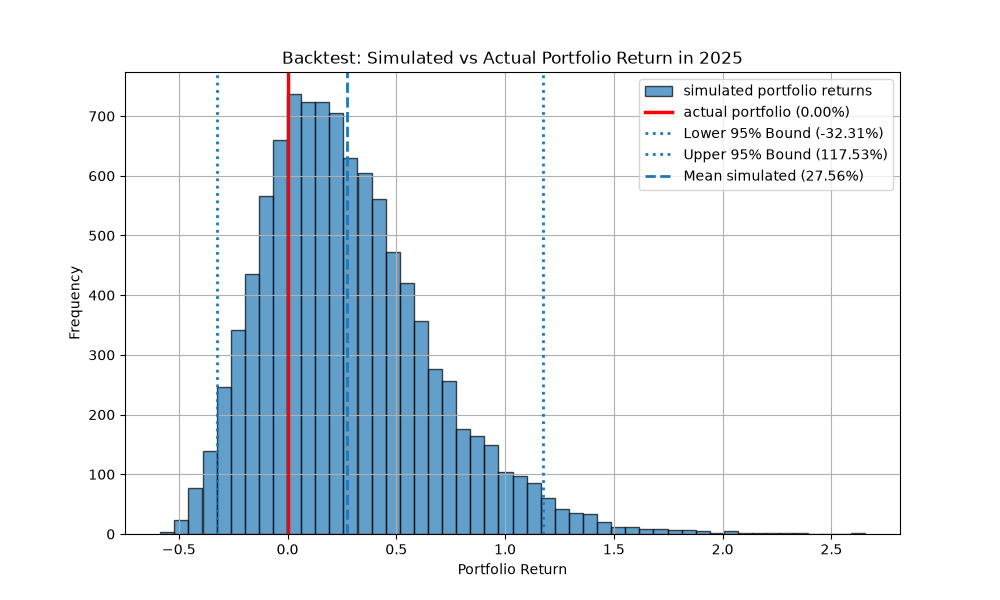

# Monte Carlo Portfolio Simulation & Backtesting

An end-to-end quantitative risk modelling project combining historical market data, Monte Carlo simulation, portfolio risk analysis and historical model validation.

## Overview

This project implements a Monte Carlo framework for multi-asset portfolio risk modelling using Geometric Brownian Motion (GBM). Historical market data are used to estimate annualised drift, volatility and cross-asset correlations, which are then incorporated into correlated Monte Carlo simulations via Cholesky decomposition. Portfolio risk is evaluated through Value at Risk (VaR), Expected Shortfall (ES) and probability of loss. Finally, the model is validated using historical backtesting against realised market returns.

This project is intended as a baseline risk modelling framework and provides a foundation for future extensions, such as Historical Bootstrap, Student-t return models and more advanced volatility modelling.


## Project Workflow

```text
Historical Market Data
        │
        ▼
Daily Log Returns
        │
        ▼
Estimate μ, σ & Correlation Matrix
        │
        ▼
GBM Monte Carlo Simulation
        │
        ▼
Portfolio Risk Analysis
        │
        ▼
Historical Backtesting
```

## Methodology
### Data Collection: 
Historical daily closing prices are downloaded directly from **Yahoo Finance** using the `yfinance` package. 
Assets used in this project: 

- NVIDIA (NVDA)
- Apple (AAPL)
- Alphabet (GOOGL)
- Amazon (AMZN)

Daily log returns are computed as

$$
r_t = \ln\left(\frac{P_t}{P_{t-1}}\right)
$$

### Parameter Estimation:
Historical log returns are used to estimate the annualised drift and volatility:

$$
\mu = 252\bar{r}
$$

$$
\sigma = \sqrt{252}s_r
$$

where $\bar r$ and $s_r$ denote the sample mean and standard deviation of daily log returns.


These parameters are then used as inputs to the Monte Carlo simulation.

### Correlation Modelling

The empirical correlation matrix is estimated from historical log returns.

Correlated random shocks generated via Cholesky decomposition preserve the empirical cross-asset dependence throughout the simulation.

$$
\Sigma = LL^\top
$$

$$
Z_{\text{corr}} = ZL^\top
$$

### Monte Carlo Simulation

Future stock prices are simulated using the Geometric Brownian Motion (GBM) model.

$$S_{t+\Delta t}=S_t\exp\left((\mu-\frac12\sigma^2)\Delta t+\sigma\sqrt{\Delta t}Z\right)$$

A total of **10,000** one-year correlated price paths are simulated.

### Portfolio Risk Analysis

- Value at Risk (95%)
- Expected Shortfall (95%)
- Probability of Loss

## Historical Backtesting
To evaluate the predictive performance of the model, an out-of-sample backtest is performed.

- **Training period:** 2020–2024
- **Testing period:** 2025

Model parameters are estimated using only the training period.

The simulated portfolio return distribution is then compared with the realised portfolio return during 2025 to evaluate whether the realised outcome falls within the simulated 95% prediction interval.

## Results

### Monte Carlo Simulation


Simulation results showing price paths, terminal price distributions, return distributions and portfolio risk metrics.


### Historical Backtesting


Comparison between the simulated portfolio return distribution and the realised portfolio return.


## Highlights

- Historical market data from Yahoo Finance
- Multi-asset portfolio modelling
- Geometric Brownian Motion (GBM)
- Correlated asset simulations using Cholesky decomposition
- Monte Carlo simulation (10,000 correlated paths)
- Portfolio Value at Risk (VaR)
- Expected Shortfall (ES)
- Historical backtesting

## Repository Structure

```
.
├── monte_carlo_simulation.py
├── monte_carlo_backtest.py
├── figures/
├── README.md
└── requirements.txt
```

## Future Improvements

- Historical Bootstrap simulation

- Student-t return model

- Rolling-window backtesting

- GARCH volatility estimation

- Sensitivity analysis


## License

This project is provided for educational purposes.


